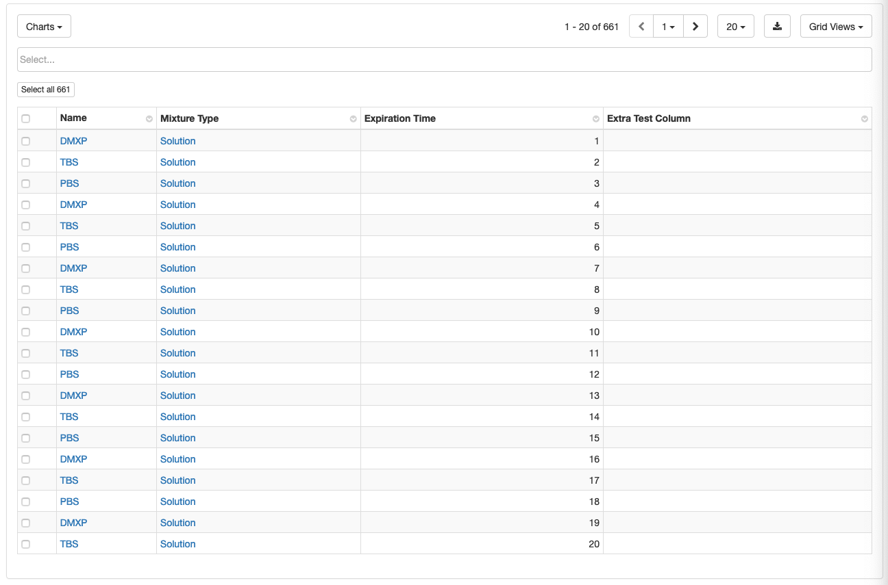
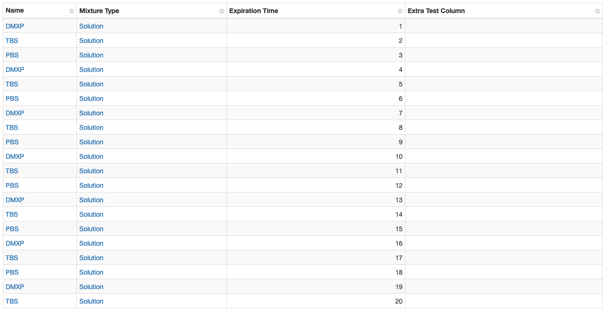
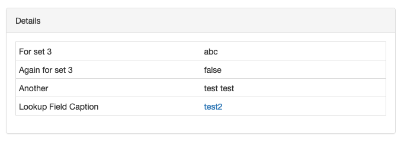

# QueryModel API

At a high level the QueryModel API is a wrapper around the selectRows API. If you need to retrieve data from a LabKey
table or query, so you can render it in a React component, then the QueryModel API is most likely what you want.

### QueryModel / QueryConfig

This is the base model used to store all the data for a query. This stores some client-side only data as well as data
retrieved by the server. You can manually instantiate a `QueryModel`, but you will almost never do this, instead you will
use the `withQueryModels` HOC to inject the needed QueryModel(s) into your component. To create a QueryModel you will need
to define a `QueryConfig` object. At a minimum, your `QueryConfig` must have a valid SchemaQuery, but we also support
many other attributes that allow you to configure the model before it is loaded, all of the attributes can be found
on the [`QueryConfig` interface](https://labkey.github.io/labkey-ui-components/interfaces/queryconfig.html) at
`src/QueryModel/QueryModel.ts`.

### withQueryModels

`withQueryModels` is a [Higher Order Component](https://reactjs.org/docs/higher-order-components.html), a function that
takes a component and returns a new component. In short `withQueryModels` takes a component that implements the
`InjectedQueryModels` interface and returns a component that implements the `MakeQueryModels` interface.

The components that you wrap can take any props you'd like, but they must include the following two props: `actions` and
`queryModels`. The `actions` prop is an `Actions` object (defined in `src/QueryModel/withQueryModels`) that provides
several methods that allow you to manipulate current models (e.g. load the model, load selections, load the next page of
results, add filters, add sorts, etc.) as well as add new models. The `queryModels` prop is an object that contains all
the `QueryModel` objects you have defined, the keys of the object are the model ids, the values of the object are the
`QueryModel` instances.

The wrapped components (returned from `withQueryModels`) will take the same props you defined, except `actions` and
`queryModels`. The `withQueryModels` HOC replaces `actions` and `queryModels` with several other props as defined by the
interface `MakeQueryModels`:
- `queryConfigs`: an object containing the queryConfigs for the models you want `withQueryModels` to instantiate. This
prop is optional.
- `autoLoad`: If autoLoad is true withQueryModels will automatically load the models when the component mounts. If false
 you will need to trigger the loading of your model(s) via `actions.loadModel(modelId)`, this is typically done in the
 componentDidMount lifecycle method of your components. Defaults to false.
- `modelLoader`: You can override how `QueryModels` are loaded by providing your own `QueryModelLoader`, you will not
typically need to use this. It is primarily useful for testing.

Below is set of examples showing off how withQueryModels is typically used.

```tsx
// First define the component you're going to wrap with withQueryModels
interface MyComponentProps {
    title: string;
}

// Here we create a type that includes InjectedQueryModels because we're wrapping the component with withQueryModels
// which will inject queryModels and actions objects.
type Props = MyComponentProps & InjectedQueryModels;

// Here we use the name ExampleComponentImpl, users will not use this component directly, only the wrapped version below
// which we expose to users as ExampleComponent.
class ExampleComponentImpl extends PureComponent<Props> {
    render() {
        const { actions, queryModels, title } = this.props;
        const model = queryModels.assayModel;

        return (
            <div className="example-component">
                <div>{title}</div>
                <div>
                    {model.isLoading && <LoadingSpinner />}
                    {!model.isLoading && <span>The assay has {model.rowCount} runs</span>}
                </div>
            </div>
        );
    }
}

// Next wrap your component with withQueryModels, here we set the type to MyComponentProps so the returned component,
// ExampleComponent, can be used in a type safe manner. In this case, if the user forgets to pass in a title we'll get
// a compiler error as intended.
export const ExampleComponent = withQueryModels<MyComponentProps>(ExampleComponentImpl);

// The component returned from withQueryModels, ExampleComponent in this case, now has the following props type:
// MyComponentProps & MakeQueryModels. To use the component you pass it a queryConfig and it will instantiate the
// models you want and pass them to ExampleComponentImpl:
const queryConfigs = { assayModel: { schemaQuery: SchemaQuery.create('assay.general.amino acids', 'Runs') }};
<ExampleComponent title="My Example Component" queryConfigs={queryConfigs} autoLoad />
```

There are more examples of withQueryModels in our QueryModel StoryBook story found in `/src/stories/QueryModel.tsx`.

To summarize:
 - Create a component that implements the `InjectedQueryModels` interface
 - Wrap your component with `withQueryModels` (e.g `const MyComponentWithModels = withQueryModels(MyComponent)`)
 - Use your wrapped component: `<MyComponentWithModels queryConfigs={myQueryConfigs} />`
    - If you don't have enough information to instantiate a model when you render your wrapped component you can always
    add a model later via `actions.addModel(queryConfig: QueryConfig)`, this is often done if a schema name or query
    name comes from user input (e.g. from a `<select>` menu).

### GridPanel

One of the most common use case for QueryModel is rendering data into a grid. We provide an easy way to render a grid
via the `GridPanel` component. `GridPanel` has many props, but the only props you need to pass are a `model` (which is
a `QueryModel`) and `actions` which is an `Actions` object. If you've wrapped your component in `withQueryModels` you
should already have these.

To render a "fully featured" GridPanel you would do this:

```tsx
<GridPanel model={myModel} actions={actions} />
```

Which would render something like this:



To render a "minimal" GridPanel, you could do this:

```tsx
<GridPanel
    model={myModel}
    actions={actions}
    asPanel={false}
    showOmniBox={false}
    showButtonBar={false}
    allowSelections={false}
/>
```

Which would render something like this:



We also provide an implementation called `GridPanelWithModel` that lets you pass in a `queryConfig` prop so you don't
need to wrap your own component with `withQueryModels`. An example of using `GridPanelWithModel`:

```tsx
interface MyComponentProps {
    schemaName: string;
    queryName: string;
}

function MyComponent(props: MyComponentProps) {
    const { schemaName, queryName }  = props;
    const queryConfig: QueryConfig = { schemaQuery: SchemaQuery.create(schemaName, queryName) };
    return <GridPanelWithModel queryConfig={queryConfig} />;
}
```


### DetailPanel
A common use case is to render the details of a single row from a SchemaQuery, we provide a component, DetailPanel, that
does this for you. There are two versions of this component: `DetailPanel` and `DetailPanelWithModel`. `DetailPanel`
expects you to have a `QueryModel` already and will render the details for you. `DetailPanelWithModel` takes a
QueryConfig object and will instantiate and load the QueryModel for you. `DetailPanel` and `DetailPanelWithModel` can be
rendered as a Bootstrap panel by setting the `asPanel` prop to true.

When using the `DetailPanel` components you need to ensure that your QueryConfig objects have a value for the `keyValue`
attribute. The `keyValue` attribute is the value of the primary key for the specified Schema/Query, this is typically
value of the `RowId` column. If there is not a single primary key column you can instead set the `baseFilters` attribute
of your QueryConfig to an array of `Filter` objects that will filter the Schema/Query to a single row of data.

#### Examples:
**DetailPanelWithModel**
```tsx
interface SampleDetailProps {
    asPanel?: boolean;
    rowId: number;
}

const SampleDetail: FC<SampleDetailProps> = ({ asPanel = false, rowId }) => {
    const queryConfig = {
        schemaQuery: SchemaQuery.create('samples', 'samples'),
        keyValue: rowId,
    };

    return <DetailPanelWithModel asPanel={asPanel} queryConfig={queryConfig} />;
};

// Use the component later:
<SampleDetail id={123} />
```

Which would render something like:


With the asPanel prop:

```tsx
<SampleDetail id={123} asPanel />
```

Which would render something like:



## Frequently asked Questions

- I have changed my `queryConfigs` object but `withQueryModels` isn't updating my models, how to I fix this?
    - `withQueryModels` ignores any changes to the `queryConfigs` object after it has mounted, this is by design. It is
    not particularly difficult to diff the `queryConfigs` object and re-instantiate any models that have changed,
    however, all child components will also need to implement complex logic to diff the incoming `queryModels` for any
    changes that would require them to update. Requiring all child components to check for changes to `queryModels` is
    tedious and error prone in our experience.
    - If you want to add models use `actions.addModel`.
    - If you want to modify a model use one of the other actions e.g. `setSchemaQuery`, `loadNextPage`, `setFilters`,
    `setSorts`.
    - A common use case is to create a queryConfigs object based on the URL of the page, and due to how React works
    navigating from one URL to another may not trigger a component remount, instead React will attempt to re-use the
    components on the page and pass new props to them. To force a remount when the user navigates to a new page pass a
    key to your wrapped component, e.g. `<GridPanelWithModel queryConfigs={myQueryConfigs} key={uniqueIdFromURL} />`.
        - This technique is most useful when you have something like `/app/my-route/{schema-name}/{query-name}` and
        the UI allows users to navigate between two pages using the same route e.g. `app/my-route/lists/listOne` and
        `app/my-route/lists/listTwo`. If a user clicks a link on the `listOne` page that naivgates them to the
        `listTwo` page React will attempt to re-use the mounted components. To force `withQueryModels` to remount and
        instantiate new models based on the `queryConfigs` you generate pass it a key like so:
        `<MyWrappedComponent queryConfigs={queryConfigs} key={schemaName + "." + queryName} />`.
- How do I allow users to link to a specific page of results on a grid?
    - If you are writing an application, and you want users to be able to send or save a link that has filters, sorts,
    or a specific page in it you can use URL Binding. When enabled, URL binding will persist certain pieces of model
    state to the URL so users can share or save links. To use URL binding you must be using the same version of React
    Router as this repo (currently version `3.2.6`) and you must set `bindURL` to true in the `QueryConfig` objects you
    pass to `withQueryModels`.
